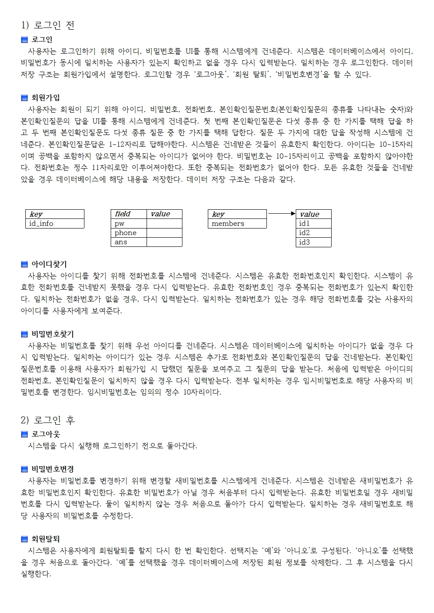
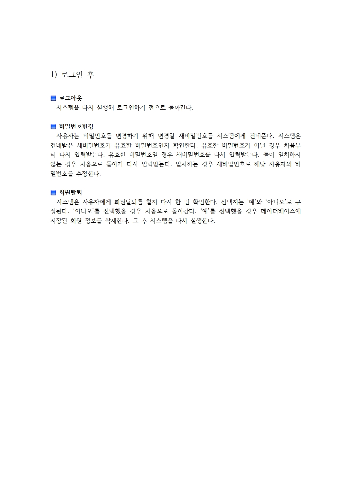

* * *

_개발환경 : Windows, VisualStudioCode, Java, Docker, Redis, Git, Maven_  
_사용 라이브러리 : Jedis_

# 프로젝트 시나리오
  
  


# Docker를 이용한 Redis 세팅
+ Power Shell, CMD, Terminal 등에 해당 쉘커맨드 입력
```
docker run -it -d -p 6379:6379 -v C:/Users/ten/docker_volume:/data redis /data/redis.conf
```

***

**Docker run 커맨드 옵션**

`-it` : bash를 이용해 컨테이너와의 표준 입력을 활성화  
`-d` : 사용중인 쉘에서 CLI 명령어 사용(Redis)을 위해 백그라운드 환경으로 컨테이너 실행  
`-p` : 컨테이너 포트를 지정해 연결, 해당 프로젝트에서는 local로 진행  
`-v` : 호스트와 컨테이너가 공유하는 디렉토리 지정  

***

**Docker 이미지**  
[Redis Image 상세정보 참조](https://hub.docker.com/_/redis)

***

**기타 명령어**  
컨테이너를 생성하며 동시에 해당 컨테이너의 디렉토리에 레디스 구성 파일을 불러오도록하는 명령어(`/data/redis.conf`) 실행

***

**Redis 구성 파일은 컨테이너 생성과 동시에 지정해야 함**  
컨테이너의 쉘커맨드로 Redis 구성 파일(*[redis.conf](https://redis.io/docs/manual/config/)*)을 지정할 경우 구성파일 을 인식하지 못함

***

**Redis 권한 인증(Requirepass) 수정**  
Redis 쉘커맨드 권한 획득을 위해 비밀번호 수정
```conf
# IMPORTANT NOTE: starting with Redis 6 "requirepass" is just a > compatibility
# layer on top of the new ACL system. The option effect will be just setting
# the password for the default user. Clients will still authenticate using
# AUTH <password> as usually, or more explicitly with AUTH default <password>
# if they follow the new protocol: both will work.
#
# The requirepass is not compatible with aclfile option and the ACL LOAD
# command, these will cause requirepass to be ignored.
#
# requirepass foobared
```
구성 파일(*redis.conf*)상의 기본 설정인 `foobared`를 변경

***

```
C:\Users\ten>docker exec -it ContainerID /bin/sh
```
컨테이너 아이디는 `docker ps -a`로 확인 가능

***

컨테이너 내부에서 커맨드 입력
```
# redis-cli
```
+ 한글이 깨질 경우 `--raw` 옵션 추가

***

ping 커맨드로 연결 상태를 확인
```
127.0.0.1:6379> ping
```
`(error) NOAUTH Authentication required.` 에러 메시지 출력시
```
127.0.0.1:6379> AUTH {requirepass}
```

***

연결 완료
```
127.0.0.1:6379> ping
PONG
```

*CLI로 저장된 데이터들을 확인하거나 관리하는 방법과 [P3X](https://www.electronjs.org/apps/p3x-redis-ui)같은 Redis GUI Desktop App을 사용하는 방법도 있음*

***

# [Jedis](https://github.com/redis/jedis), [Redis](https://redis.io/) feature

jedis : redis용 java 클라이언트

pom.xml의 dependency에 추가

```xml
<dependency>
    <groupId>redis.clients</groupId>
    <artifactId>jedis</artifactId>
    <version>4.2.0</version>
</dependency>
```


1. 제디스 풀에대한 설명
2. 사용하는 레디스 명령어에 대한 설명


**Redis `Set` 자료형의 특성**  
Entity 수에 관계없이 시간복잡도 O(1)를 갖는 자료형  
관리해야할 회원의 수가 많아져도 효율적인 데이터 관리가 가능

| Group | Command   | TimeComplexity |
|-------|-----------|----------------|
| set   | sadd      | O(1)           |
| set   | srem      | O(1)           |
| set   | sismember | O(1)           |

별도의 [체인 해시 테이블](https://en.wikipedia.org/wiki/Hash_table)을 사용해 구현  
정확히는 시간복잡도O(1+n/k)를 가짐 n : 항목 수, k : 버킷 수  
버킷 수를 항목 수에 따라 증가(재해싱)시켜 n/k를 낮게 유지  
결과적으로 시간복잡도는 O(1)에 근사

> *하나의 버킷에 체인 해시 형태로 여러 엔티티가 지정될 경우*  
> `Time Complexity > 1` (조건 : 버킷 수 < 항목 수)

> *하나의 버킷에 하나의 엔티티가 지정될 경우*  
> `Time Complexity = 1` (조건 : 버킷 수 >= 항목 수)

# jedis를 사용하기 위한 threadlocal에 대한 설명 추가 (소켓 익셉션 언급)
1. 클래스 다이어그램 설명
2. 각 기능별 코드 설명 및 사용법
3. 코드를 길게 나열하지 않아도 됨 여기서 깃헙 레포 링크 걸기

pool -> 하나만 써서 전부 통신하기 때문에 문제된 것

스레드로컬 사용해서 스레드마다 다른 제디스를 사용하게 끔 함

기존 -> 풀에서 하나를 겟리소스로 빼와서 멀티스레드에서 사용해서 문제됨 (제디스 동기화 지원 안함)


[Home](./)