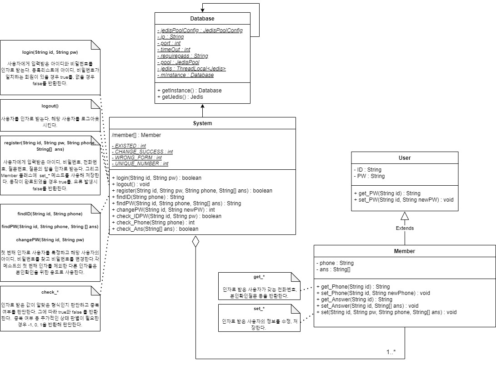

* * *

_개발환경 : Windows, VisualStudioCode, Java, Docker, Redis, Git, Maven_  
_사용 라이브러리 : Jedis_

# 프로젝트 시나리오
  

# Docker를 이용한 Redis 세팅
### 1. Power Shell, CMD, Terminal 등에 해당 쉘커맨드 입력

```
docker run -it -d -p 6379:6379 -v C:/Users/ten/docker_volume:/data redis:latest /data/redis.conf
```

***

+ Docker run 커맨드 옵션  
`-it` : bash를 이용해 컨테이너와의 표준 입력을 활성화  
`-d` : 사용중인 쉘에서 CLI 명령어 사용(Redis)을 위해 백그라운드 환경으로 컨테이너 실행  
`-p` : 컨테이너와 호스트의 연결 포트를 지정, 해당 프로젝트에서는 local로 진행  
`-v` : 호스트와 컨테이너가 공유하는 디렉토리 지정  
> ✔ *해당 디렉토리에 회원정보를 저장함(e.g. rdb, aof)*

***

+ Docker 이미지  
[redis:latest](https://hub.docker.com/_/redis)

***

+ 기타 명령어  
컨테이너를 생성하며 동시에 해당 컨테이너의 디렉토리에 레디스 구성 파일을 불러오도록하는 명령 구문
```
/data/redis.conf
```

✔ Redis 구성 파일은 컨테이너 생성과 동시에 지정해야 함  
별도로 컨테이너의 쉘커맨드로 Redis 구성 파일(*[redis.conf](https://redis.io/docs/manual/config/)*)을 지정할 경우 구성파일을 인식하지 못함

***

### 2. Redis 권한 인증(Requirepass) 수정  

```conf
# IMPORTANT NOTE: starting with Redis 6 "requirepass" is just a > compatibility
# layer on top of the new ACL system. The option effect will be just setting
# the password for the default user. Clients will still authenticate using
# AUTH <password> as usually, or more explicitly with AUTH default <password>
# if they follow the new protocol: both will work.
#
# The requirepass is not compatible with aclfile option and the ACL LOAD
# command, these will cause requirepass to be ignored.
#
# requirepass foobared
```
구성 파일(*redis.conf*)상의 기본 설정인 `foobared`를 변경

***

### 3. Redis 연결 확인
앞서 생성한 컨테이너에 명령을 내리기 위해 접속
+ `ContainerID`는 `docker ps -a`로 확인  

```
C:\Users\ten>docker exec -it ContainerID /bin/sh
```

***

컨테이너 내부의 `Redis`에 접속  

+ 한글이 깨질 경우 `--raw` 옵션 추가  

```
# redis-cli
```

***

ping 명령으로 클라이언트 서버가 작동하는지, 서버 연결이 유효한지 검사
```
127.0.0.1:6379> ping
```

***

에러 메시지 (`(error) NOAUTH Authentication required.`) 출력 시 수정한 requirepass로 권한 획득
```
127.0.0.1:6379> AUTH {requirepass}
```

***

확인 완료
```
127.0.0.1:6379> ping
PONG
```  

✔ *CLI로 저장된 데이터들을 확인하거나 관리하는 방법과 [P3X](https://www.electronjs.org/apps/p3x-redis-ui)같은 Redis GUI Desktop App을 사용하는 방법도 있음*

***

# [Jedis](https://github.com/redis/jedis), [Redis](https://redis.io/) feature

Jedis는 redis용 java 클라이언트로 사용하기 전 `pom.xml`에 dependency 추가

```xml
<dependency>
    <groupId>redis.clients</groupId>
    <artifactId>jedis</artifactId>
    <version>4.2.0</version>
</dependency>
```

Jedis connection pool에서 필요할 때마다 리소스를 할당받아 사용  

```java 
private static final JedisPool pool = new JedisPool(jedisPoolConfig, ip, port, timeOut, requirepass);
jedis = pool.getResource();
```

**Redis `Set` 자료형의 특성**  
Entity 수에 관계없이 시간복잡도 `O(1)`를 갖는 자료형  
관리해야할 회원의 수가 많아져도 효율적인 데이터 관리가 가능

| Group | Command   | TimeComplexity |
|:-----:|:---------:|:--------------:|
| set   | sadd      | O(1)           |
| set   | srem      | O(1)           |
| set   | sismember | O(1)           |

이는 별도의 [체인 해시 테이블](https://en.wikipedia.org/wiki/Hash_table)을 사용해 구현  
정확히는 시간복잡도 `O(1+n/k)`를 가짐 n : 항목 수, k : 버킷 수  
버킷 수를 항목 수에 따라 증가(재해싱)시켜 `n/k`를 낮게 유지  
결과적으로 시간복잡도는 `O(1)`에 근사함

> *하나의 버킷에 체인 해시 형태로 여러 엔티티가 지정될 경우*  
> `Time Complexity > 1` (조건 : 버킷 수 < 항목 수)

> *하나의 버킷에 하나의 엔티티가 지정될 경우*  
> `Time Complexity = 1` (조건 : 버킷 수 >= 항목 수)

# Threadlocal을 이용한 Jedis 사용
Threadlocal은 스레드 별 각각의 변수를 사용할 수 있게 함  

하나의 Jedis 자원을 사용해 멀티스레드 환경에서 통신할 때 `Socket Exception`이 발생  
이를 해결하고 손쉽게 통신 트래픽을 분산시키기 위해 Threadlocal을 사용  

***

*스레드 마다 `getJedis()`로 `pool`에서 Jedis 자원을 할당받아 사용*  

``` java
private static final JedisPool pool = new JedisPool(jedisPoolConfig, ip, port, timeOut, requirepass);
private static final ThreadLocal<Jedis> jedis = new ThreadLocal<>();

public Jedis getJedis() {
    var result = jedis.get();
    if (result == null) {
        result = pool.getResource();
        jedis.set(result);
    }
    return result;
}
```

# 클래스 다이어그램
  


# 주요 메소드
+ 몇 가지 주요 메소드를 소개하고 나머지 모든 구현은 [레포지토리](https://github.com/tiktaalik7/login_service) 참조  

***

### 로그인 메소드  
```java
    public boolean login(String id, String pw) throws NoSuchAlgorithmException {
        var database = mDatabase.getJedis();
        var value = MessageDigest.getInstance("SHA-256");
        var builder = new StringBuilder();

        if (check_IDPW(id, pw)) {
            if (database.sismember("key_Members", id)) {
                value.update(pw.getBytes());
                for (var piece : value.digest()) {
                    builder.append(String.format("%02x", piece));
                }
                if (database.hget(id + "_info", "key_PW").equals(builder.toString())) {
                    return true;
                }
            }
        }

        return false;
    }
```

### 회원가입 메소드   
```java
    public boolean register(String id, String pw, String phone, String[] ans) throws NoSuchAlgorithmException {
        var database = mDatabase.getJedis();

        if (check_IDPW(id, pw) && !database.sismember("key_Members", id)) {
            if ((check_Phone(phone) == UNIQUE_NUMBER) && check_Ans(ans) == SUCCESS) {
                Member member = new Member();
                member.set(id, pw, phone, ans);
                return true;
            }
        }

        return false;
    }
``` 

[*Home*](./)