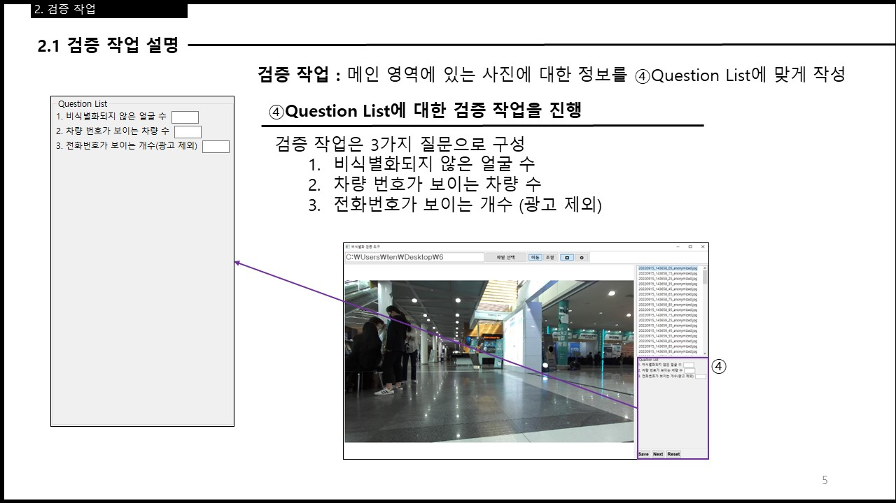

* * *

_개발환경 : Windows, VisualStudioCode, Java, SWT, Git, Maven_  
_사용 라이브러리 : SWT, OpenCV_

# 프로젝트 개요

>   
> 출처 : https://viso.ai/deep-learning/face-blur-for-privacy-aware-deep-learning/  

## 프로젝트 목적
> + ML/DL에 사용할 학습 데이터 셋 구축
> + 개인정보 비식별화 과정을 거친 이미지를 2차 검증

## 비식별화 대상 정보
>+ 이목구비가 드러난 얼굴
>   + 마스크를 착용한 경우 눈이 드러난 경우
>   + 광고에 사용된 얼굴 제외
>
> + 전화번호
>   + 광고에 사용된 전화번호 제외
>
> + 차량 번호판
>   + 구형 신형에 따라 절반이상 보일 경우

## 비식별화 검증 과정





# 구현
## MVC 디자인 패턴 사용
+ 타겟 파일마다 각각 Veil에 대한 정보와 검증 질문에 대한 답 3가지를 함께(이하 타겟 파일 정보) 갖는다.  
+ 타겟 파일 정보에 따라 View를 계속해서 Update해야 하므로 MVC 패턴을 채용했다.

+ 'Next' 버튼의 동작 과정  


## 모델 구조

고려해야할 점
1. 사용자마다 실행환경이 다름(모니터 등)
2. 비식별화된 이미지의 규격이 각각 다름

사용자에게 일관된 기능을 제공하기 위해 

2번 해결 : 사진의 가로 세로 비율이 사진이 그려질 배경의 가로 세로 비율과 비교해 긴 부분(가로 or 세로)을 기준으로 사진과 배경의 비율을 구한다. 이후 해당 비율을 사진 전체에 적용하는 방식으로 다양한 규격의 이미지를 비식별화 검증 도구에서 일관되게 확인할 수 있도록 변경


## 데이터 저장 및 유지
+ 데이터의 저장은 파일명, 질문1, 질문2, 질문3, veils CSV 형식으로 저장한다.

+ 모델의 구조는 다음과 같다.


+ veil의 매커니즘은 다음과 같다.
  + 저장은 ratio로 디스플레이할 때만 value로 변환해 사용
  + 이미지의 크기가 변할 때 veil도 맞춰주기 위해 비율을 사용
  + 다양한 모니터 환경에서도 동일한 veil을 표현하기위해 비율을 사용


+ veil의 저장 형식  

|도형의 종류 식별  | x 위치(비율) | y 위치 (비율) |width (비율)| height(비율)|
|:-:|:----------:|:---------:|:---------:|:---------:|
| 1 or 0 | 0.5        | 0.33        |0.12|0.12|

*도형의 종류는 1 : 사각형, 0 : 타원*


### 픽셀값에서 비율로 변환하는 과정
+ 전체 이미지에서 veil의 위치를 비율로 나타냄
+ veil의 위치(x, y)[비율] = veil의 위치(x, y)[픽셀] / 이미지의 크기(width, height)[픽셀]

```java
private Veil value2Ratio(Veil veil, Rectangle imgBounds, Rectangle backBounds) {
        // 파라미터 veil은 value값을 갖는 veil;
        double posX;
        double posY;
        double ratioX;
        double ratioY;
        double ratioWidth;
        double ratioHeight;

        posX = veil.x - ((backBounds.width - imgBounds.width) / 2);
        posY = veil.y - ((backBounds.height - imgBounds.height) / 2);

        ratioX = posX / imgBounds.width;
        ratioY = posY / imgBounds.height;

        ratioWidth = veil.width / imgBounds.width;
        ratioHeight = veil.height / imgBounds.height;

        Veil resultVeil = new Veil(veil.shape, ratioX, ratioY, ratioWidth, ratioHeight, veil.angle);

        return resultVeil;
    }
```

### 비율에서 픽셀값으로 변환하는 과정
+ 비율로 표현된 veil의 위치를 사진 상의 픽셀로 나타냄
+ veil의 위치(x, y)[픽셀] = veil의 위치(x, y)[비율] X 이미지의 크기(width, height)[픽셀]

```java
public ArrayList<Veil> ratio2Value(ArrayList<Veil> veils, Rectangle imgBounds, Rectangle backBounds) {
    ArrayList<Veil> resultVeils = new ArrayList<>();
    Veil veil;
    double posX;
    double posY;
    double valueX;
    double valueY;
    double valueWidth;
    double valueHeight;
    for (var piece : veils) {
        posX = piece.x * imgBounds.width;
        posY = piece.y * imgBounds.height;
        valueX = posX + ((backBounds.width - imgBounds.width) / 2);
        valueY = posY + ((backBounds.height - imgBounds.height) / 2);
        valueWidth = piece.width * imgBounds.width;
        valueHeight = piece.height * imgBounds.height;
        veil = new Veil(piece.shape, valueX, valueY, valueWidth, valueHeight, piece.angle);
        resultVeils.add(veil);
    }
    return resultVeils;
}
```


원본파일의 유지와 veil 삭제를 위해 비식별화 검증 도구에서는 항상 원본을 사용한다.

사용자의 입력이 사진에 곧바로 저장되는 것이 아닌 엑셀 파일에 해당 내용을 저장한 뒤

비식별화 검증 도구 상에서 원본사진에 입혀서 나타낸다.

수정된 사진을 사용할 경우 veil을 삭제할 경우 해당 부분의 이미지 정보를 갖고있지 않기 때문에 원본을 사용한다.

이런 구현을 가능하게 하기 위해 veil의 저장 규칙을 세울 필요가 있었다.

veil의 저장 규칙은 다음과 같다.

>*비식별화 검증 도구에 나타낼 때에만 ratio2value 메소드를 통해 픽셀로 나타내고 그 외의 모든 경우에는 value2ratio 메소드를 통해 비율로 다룬다.*


## 데이터 로드 개선
타겟 파일의 용량에 따라 비식별화 검증 도구가 로드하는데에 시간이 오래 걸린다.


| 시행 | Before[ms] | After[ms] |
|:----:|:----------:|:---------:|
|   1  | 188        | 17        |
|   2  | 175        | 14        |
|   3  | 185        | 15        |
|   4  | 186        | 12        |
|   5  | 177        | 14        |

해당 내용은 PreLoad 클래스에서 확인할 수 있다.

## 상대경로

문제점 : 이미지의 정보(이미지의 위치 및 이미지명)에 따라 결과파일?을 생성하는데 비식별화 검증 도구를 사용하는 환경이 변화하면 즉, 이미지의 위치가 달라질 경우 이전에 저장해둔 절대경로를 사용하기 때문에 문제가 발생했다. 

따라서 상대좌표를 사용하도록 개선했고 이에 수반되는 단점은 지정된 targetfolder에 타겟 이미지를 넣어야 된다는 점이다.


# 배포
launch4j를 이용해 exe 파일로 랩핑해 배포한다.

# NIA 과제 수행
10명 이상의 크라우드 워커 참여
22년 10월 ~ 23년 1월

[*Home*](./)