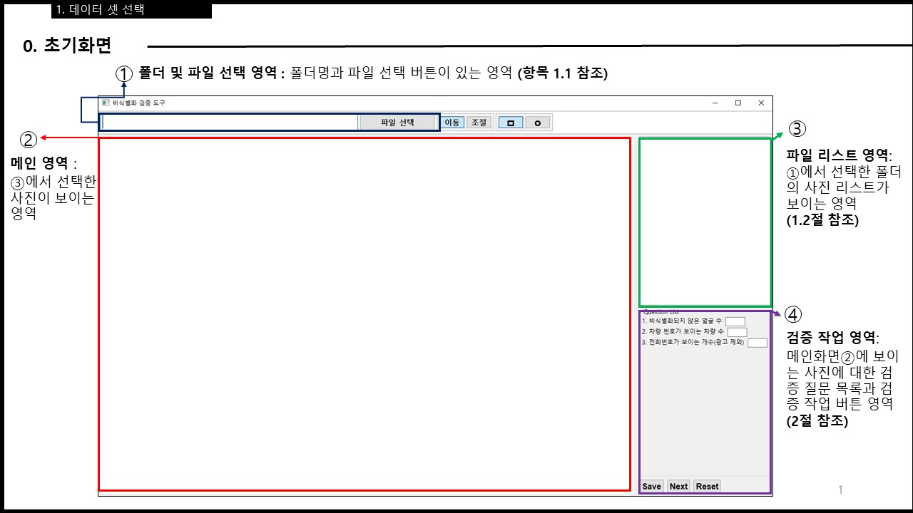
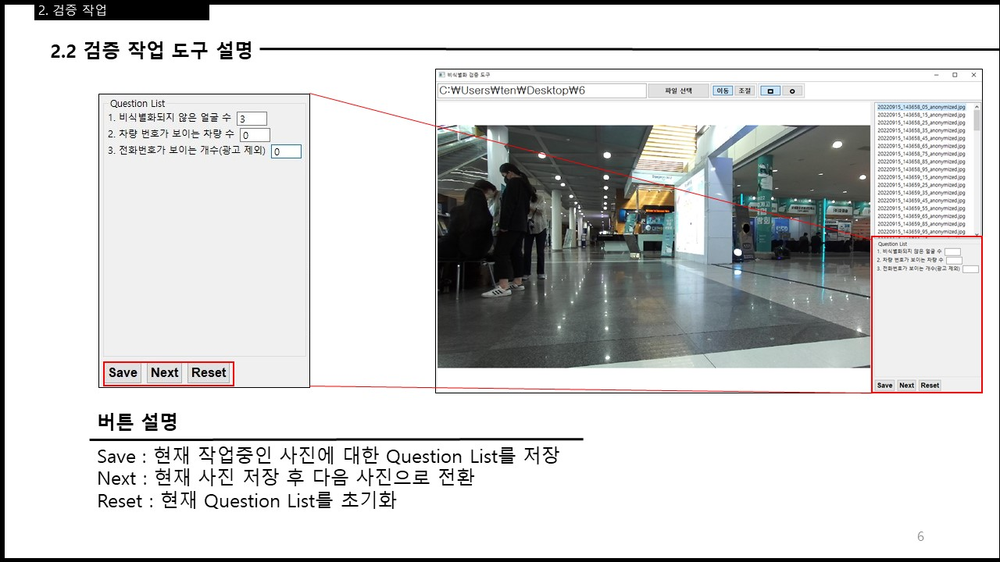
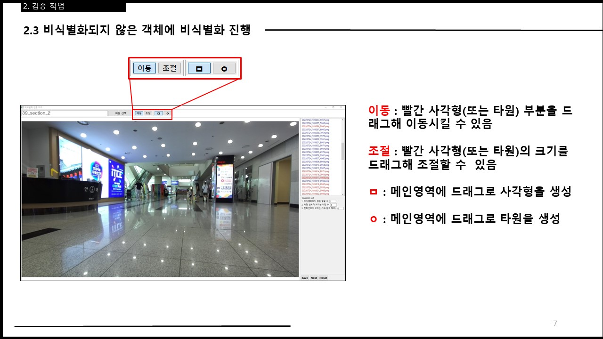
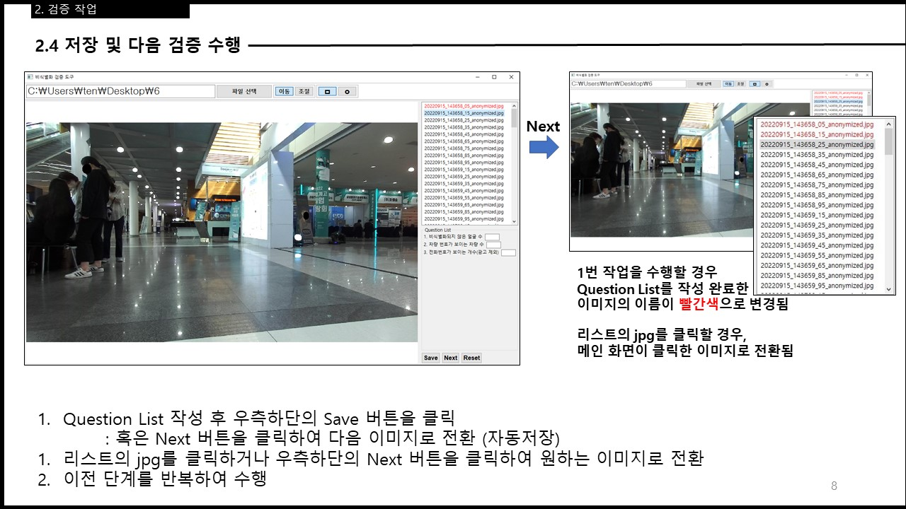

* * *

_개발환경 : Windows, VisualStudioCode, Java, SWT, Git, Maven_  
_과제번호 : 202207810001_
  

# 1. 프로젝트 개요

>   
> 출처 : https://viso.ai/deep-learning/face-blur-for-privacy-aware-deep-learning/  

## 1.1 프로젝트 목적
> **비식별화 검증 역할을 수행하는 도구(Tool) 제작**  
> + ML/DL에 사용할 학습 데이터(이미지) 셋 구축
> + 개인정보 비식별화 과정을 거친 이미지를 2차 검증  

## 1.2 비식별화 대상
>+ 이목구비가 드러난 얼굴
>   + 마스크를 착용한 경우, 눈이 드러난 얼굴
>   + 광고에 사용된 얼굴 제외
>
> + 전화번호
>   + 광고로 사용된 전화번호 제외
>
> + 차량 번호판
>   + 구형과 신형에 따라 절반이상이 보이는 차량 번호판

## 1.3 비식별화 검증 과정







|**사용 예**|
|:---|
||

# 2. 구현
## 2.1 MVC 디자인 패턴 사용
+ 타겟 파일마다 각각 Veil에 대한 정보와 검증 질문에 대한 답 3가지(이하 타겟 파일 정보) 포함
+ 타겟 파일 정보에 따라 View를 계속해서 Update해야 하므로 MVC 패턴을 채용

**예) `Next` 버튼의 동작 과정**  


## 2.2 모델 구조

모든 사용자에게 일관된 기능을 제공하기 위해 고려해야할 점  

1. 사용자마다 다른 실행환경(모니터 등)
2. 비식별화된 이미지의 다양한 규격


> **알고리즘**  
> 1. 사진의 가로 세로 비율이 사진이 그려질 배경의 가로 세로 비율과 비교해 긴 부분(가로 또는 세로)을 기준으로 사진과 배경의 비율을 구한다.
> 2. 구한 비율을 사진 전체에 적용한다.
> 3. 다양한 규격의 이미지를 비식별화 검증 도구에서 일관되게 확인할 수 있도록 한다.

## 2.3 데이터 저장 및 유지
+ 영속성을 위해 저장해야 할 최소 데이터는 다음과 같다.
  + `파일명`, `질문 1`, `질문 2`, `질문 3`, `Veils CSV`  

    + `파일명` : 타겟이 되는 파일의 파일 명으로 targetfolder 이후의 파일 디렉토리를 포함  
    + `질문` : 각 질문에 대한 답이 해당  
    + `Veils CSV` : 아래에서 자세히 설명  

**Veil의 매커니즘**  
+ Veil의 정보는 비율로 처리하며 실제 Veil을 디스플레이할 때만 픽셀값으로 변환해 사용
  + 이미지의 크기가 변할 때 Veil도 맞춰주기 위해 비율을 사용  
  + 다양한 모니터 환경에서도 동일한 Veil을 표현하기위해 비율을 사용


> + Veil의 저장 형식 예  
>
>|도형의 종류 식별  | x 위치(비율) | y 위치 (비율) |width (비율)| height(비율)|
>|:-:|:----------:|:---------:|:---------:|:---------:|
>| 1 or 0 | 0.5        | 0.33        |0.12|0.12|
>
>*도형의 종류는 1 : 사각형, 0 : 타원*


### 픽셀값에서 비율로 변환하는 과정
+ 전체 이미지에서 Veil의 위치 및 크기를 비율로 나타냄
+ Veil의 위치 및 크기[비율] = Veil의 위치 및 크기[픽셀] / 이미지의 크기(width, height)[픽셀]

```java
private Veil value2Ratio(Veil veil, Rectangle imgBounds, Rectangle backBounds) {
        double posX, posY;
        double ratioX, ratioY;
        double ratioWidth, ratioHeight;

        posX = veil.x - ((backBounds.width - imgBounds.width) / 2);
        posY = veil.y - ((backBounds.height - imgBounds.height) / 2);

        ratioX = posX / imgBounds.width;
        ratioY = posY / imgBounds.height;

        ratioWidth = veil.width / imgBounds.width;
        ratioHeight = veil.height / imgBounds.height;

        Veil resultVeil = new Veil(veil.shape, ratioX, ratioY, ratioWidth, ratioHeight, veil.angle);

        return resultVeil;
    }
```

### 비율에서 픽셀값으로 변환하는 과정
+ 비율로 표현된 Veil의 위치 및 크기를 사진 상의 픽셀로 나타냄
+ Veil의 위치 및 크기[픽셀] = Veil의 위치 및 크기[비율] X 이미지의 크기(width, height)[픽셀]

```java
public ArrayList<Veil> ratio2Value(ArrayList<Veil> veils, Rectangle imgBounds, Rectangle backBounds) {
    ArrayList<Veil> resultVeils = new ArrayList<>();
    Veil veil;
    double posX;
    double posY;
    double valueX;
    double valueY;
    double valueWidth;
    double valueHeight;
    for (var piece : veils) {
        posX = piece.x * imgBounds.width;
        posY = piece.y * imgBounds.height;
        valueX = posX + ((backBounds.width - imgBounds.width) / 2);
        valueY = posY + ((backBounds.height - imgBounds.height) / 2);
        valueWidth = piece.width * imgBounds.width;
        valueHeight = piece.height * imgBounds.height;
        veil = new Veil(piece.shape, valueX, valueY, valueWidth, valueHeight, piece.angle);
        resultVeils.add(veil);
    }
    return resultVeils;
}
```
  
> **요약**
>
>*비식별화 검증 도구에 나타낼 때에만 ratio2value 메소드를 통해 픽셀로 나타내고 그 외의 모든 경우에는 value2ratio 메소드를 통해 비율로 다룬다.*

**전체 데이터 구조**  
[파일 명, 질문1의 답, 질문2의 답, 질문3의 답, Veil정보]  


## 2.4 작업 시간 단축
+ 키보드만으로 동작할 수 있도록 해 비식별화 검증 작업의 소요시간을 단축한다.  

  

*키보드 입력 버퍼 이슈로 건너뜀 현상 발생, 현재 비활성화..*

## 2.5 데이터 로딩 시간 개선
+ 이번 프로젝트에서 사용한 타겟 파일은 대부분 고용량 이미지로 로딩 시간이 오래 걸림  
  + 이미지 로드만을 수행하는 별도의 스레드를 구현해 해당 문제를 해결


`연두색 화살표` : 사용자의 작업  
`노란색 화살표` : 비식별화 검증 도구의 작업  

**개선 전후 로딩 시간 비교**  
비교에 사용한 이미지는 5k 이미지 (5120x2880)  

| 시행 | 개선 전 [ms] | 개선 후 [ms]|
|:----:|:----------:|:---------:|
|   1  | 188        | 17        |
|   2  | 175        | 14        |
|   3  | 185        | 15        |
|   4  | 186        | 12        |
|   5  | 177        | 14        |

_해당 내용은 PreLoad 클래스에서 확인할 수 있다._

## 2.6 경로 설정 문제

크라우드 워커 분들 중 프로그램의 실행환경을 옮겨다니며 작업하는 분이 계셨다.  
따라서 상대 경로를 사용하도록 프로그램을 변경하였다.

+ 절대 경로  
  + 장점 : 사용자가 원하는 디렉토리에 타겟파일과 프로그램을 두고 관리할 수 있다.
  + 단점 : 한 번 설정해둔 디렉토리에서 벗어나기 어렵다.  
  
+ 상대 경로  
  + 장점 : 프로그램의 작업 환경을 쉽게 바꿔가며 사용할 수 있다.
  + 단점 : 지정된 디렉토리에 타겟파일과 프로그램을 위치시켜야 한다.

# 3. 배포
+ 배포 방식  
  + launch4j를 이용해 exe 파일로 랩핑해 배포  
+ 문제 발생 및 대처  
  + 프로그램에 사용한 글꼴이 사용자의 컴퓨터에 존재하지 않아 발생하는 문제  
      + Windows의 기본글꼴이 사용되게끔 글꼴설정을 제외하고 배포
  + 다양한 실행환경에서 옮겨다니며 프로그램을 사용할 때 발생하는 문제  
      + 사용자가 설정한 절대경로를 이용하지 않고 상대경로로 동작하게 수정
  + 타겟 파일의 오류로 인해 프로그램이 정지하는 문제
    + 해당 타겟 파일을 다시 비식별화하기 위해 사용자에게 해당 타겟 파일 보고 요청

[*Home*](./)