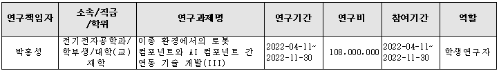
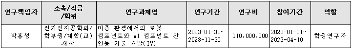
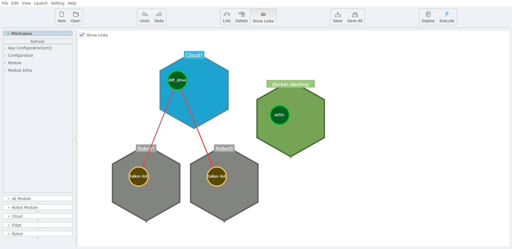
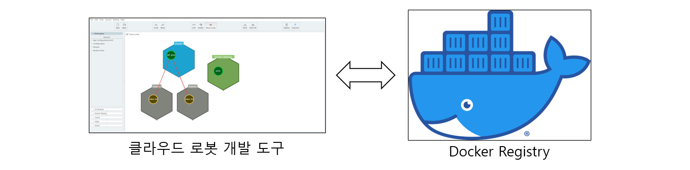
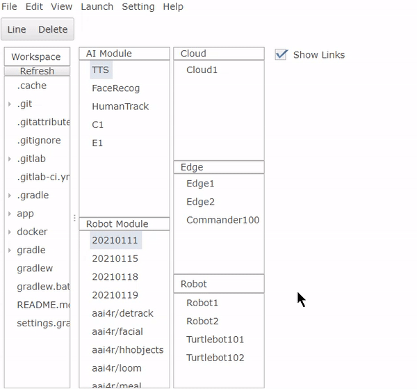
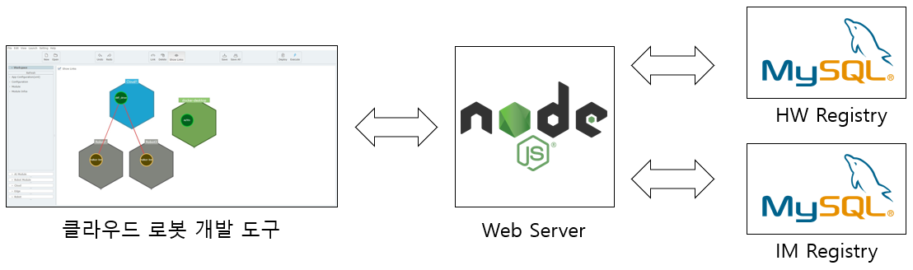
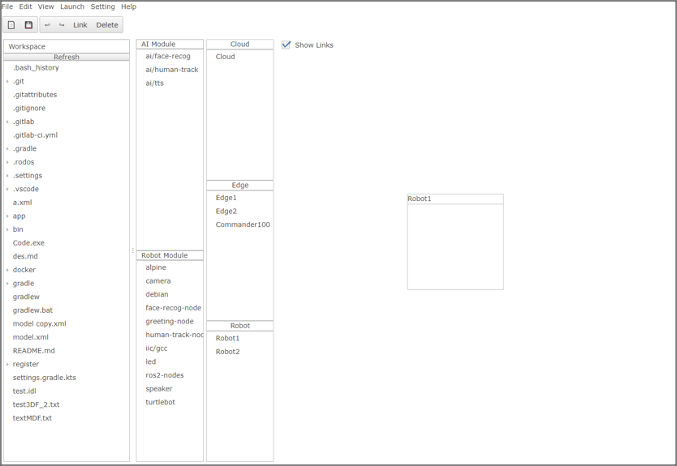
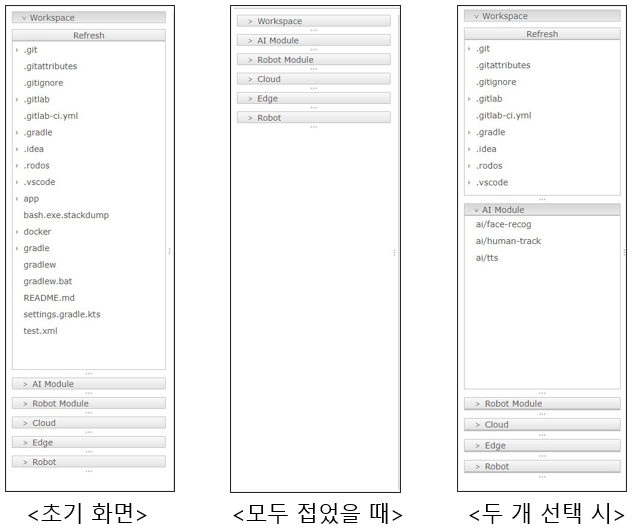
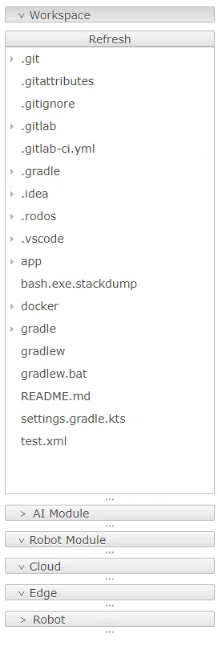
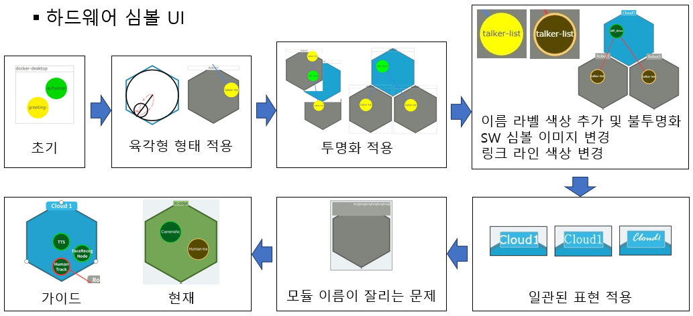

* * *

_개발환경 :  Windows, VisualStudioCode, Java, SWT, Git, Gradle_  
_과제번호 : 202204000001, 202300430001_
  
  

# 1. 프로젝트 개요  
+ **이종 환경에서의 로봇 컴포넌트와 AI컴포넌트간 연동 기술 개발**  
  

## 1.1 프로젝트 목적  
+ 본 용역은 클라우드 AI 로봇 응용을 쉽게 개발하고 재활용할 수 있도록 도와주는 이종 환경에선의 로봇 컴포넌트와 AI 컴포넌트간 연동기술 개발을 목적으로 하며, 상세 목적은 기 개발된 기술을 기반으로 컴포넌트들을 효과적으로 조합하고 배포하며 관련 정보 모델을 쉽게 편집하는 기술 개발을 목적으로 한다.  

# 2. 나의 역할?  
+ AI 컴포넌트와 로봇 ROS 컴포넌트들을 그래픽 기반으로 연결하고, 개발된 AI 컴포넌트 및 로봇 모듈을 배포할 수 있도록 패키징할 수 있도록 도와주는 저작 도구 개발  

+ 웹 기반 모듈 조합/패키징 개발도구 개발  
  + 클라우드 기반 모듈 조합 및 배포 패키징용 사용자 친화형 저작 도구 개발  

## 2.1 [Docker Registry](https://docs.docker.com/registry/spec/api/)에서 이미지 목록 리스트업  
+ **Docker Registry를 사용해 구현**


### 2.1.1 Docker Registry로부터 Image 목록 획득  
+ [Retrofit](https://square.github.io/retrofit/) 인터페이스 정의  
`catalog(int n, String last)` : last 이후부터 n개 이미지 목록을 가져오기  
`catalog(int n)` : 첫 이미지부터 n개 이미지 목록을 가져오기  
`catalog()` : 이미지 목록을 전부 가져오기  

```java
interface DockerService {
    @GET("/v2/_catalog")
    Call<Res> catalog(@Query("n") int n, @Query("last") String last);

    @GET("/v2/_catalog")
    Call<Res> catalog(@Query("n") int n);

    @GET("/v2/_catalog")
    Call<Res> catalog();
}
```

+ Gson 라이브러리 사용  
Json 형식을 띄며 직렬화된 반환값을 Java Object로 받을 수 있도록 역직렬화를 하기 위해 사용  
  

+ Dcoker Registry에 접근하기 위해 Base64 인코딩된 인증 정보 필요  
  + 디코딩이 가능하기 때문에 보안성이 높은 방식은 아님
  + 시스템과 독립적으로 전송 또는 저장을 보장하기 위해 사용

```java
var auth = "Basic " + Base64.encodeBytes((user + ":" + password).getBytes());
var client = new OkHttpClient.Builder().addInterceptor(new Interceptor() {
    @Override
    public okhttp3.Response intercept(Chain chain) throws IOException {
        var req = chain.request().newBuilder().header("Authorization", auth).build();
        return chain.proceed(req);
    }
}).build();
```

+ SSL 인증서 무시 추가
  + 추후에 변경될 방식(Docker Registry 사용)이기 때문에 SSL 인증서 없이 사용  
  + 인증서를 처리하는 메소드 내부를 구현하지 않아 모든 인증서가 유효한 인증서로 처리됨  

```java
var cert = new X509TrustManager() {
    @Override
    public void checkClientTrusted(~) {}

    @Override
    public void checkServerTrusted(~) {}

    @Override
    public X509Certificate[] getAcceptedIssuers() {}
}
```

### 2.1.2 Image 목록을 저작 도구에 리스트업  
+ `Robot Module` 메뉴에 이미지 목록이 리스트업 및 동작 확인  


## 2.2 Registry 구축  
+ **Docker Registry를 사용하지 않고 직접 구축**  


### 2.2.1 IM Database 구축  
| 가이드 UI | 수정 전 UI|
|:-----:|:---------:|
|||
+ 데이터 필드
+ 이름에서 아이디로 키 변경한 내용

### 2.2.2 HW IM Database 구축  
+ 데이터 필드

### 2.2.3 Web Server 구축  
+ 레트로핏 인터페이스 정의
+ Lazy loading이 불가능했던 이유
+ Lazy loading 구현

## 2.3 UI 수정
| 수정 후 UI | 수정 전 UI|
|:-----:|:---------:|
|||

### 2.3.1 서랍 형식 사이드바 구현
+ 목표  
  + 선택한 메뉴는 열리고 다른 메뉴는 닫아 놓을 수 있도록 서랍형식으로 사이드바를 구현
+ 구현  
  + Java SWT에 서랍 형식의 사이드바 관련된 Composite이 존재하지 않아 SashForm, Button 등으로 직접 구현
+ 특징  
  + 일정한 사용 경험을 제공하기 위해 다양한 동작환경에서도 안정적으로 기능하도록 개발
    + 실행환경(모니터 해상도)에 따른 비율을 계산해 동작하도록 함
  + 최대 두 개의 메뉴를 열어놓을 수 있도록 함
    + 두 개 이상의 메뉴가 열려있을 때 새로운 메뉴를 열 때 가장 먼저 선택된 메뉴가 닫히도록 구현
  + 메뉴 마다 상하 크기를 조절할 수 있도록 함
  + 사이드바 좌우 크기를 조절할 수 있도록 함
+ 사진  
  
+ 영상  
  


### 2.3.2 HW 심볼 UI 수정
  
> **단계별 설명**  
> `초기` : 기준이 되는 초기 상태  
> `육각형 형태 적용` : 육각형 레이아웃을 적용, SW 심볼이 육각형의 내접원을 벗어나지 못하도록 제한  
> `투명화 적용` : 한정된 저작 도구 공간을 효율적으로 사용할 수 있도록 겹쳐지도록 수정하면서 투명화 적용  
> `이름 라벨 색상 추가 및 불투명화 SW 심볼 이미지 변경 링크 라인 색상 변경` : 레이아웃 및 UI 정돈  
> `일관된 표현 적용` : 사용자의 웹브라우저의 글꼴에 영향을 받는 현상이 발생해 저작 도구의 글꼴을 고정함  
> `모듈 이름이 잘리는 문제` : 모듈의 이름이 길 경우 개행할 수 있도록 구현  

## 2.4 Docker Agent의 진행상황 표현 및 관리
+ 진행중

[*Home*](./)